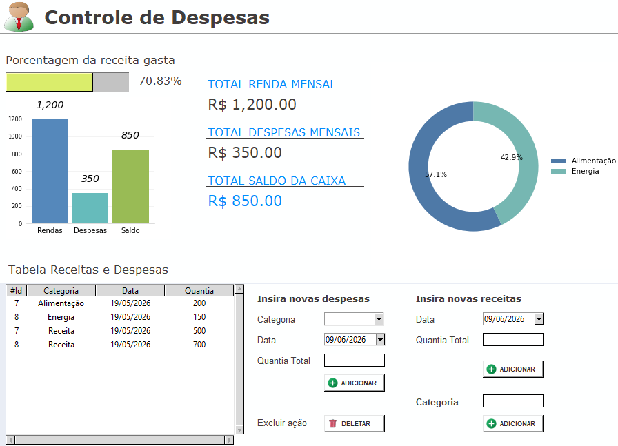

# Controle de Despesas

Sistema desktop de gerenciamento de finanças desenvolvido em Python com inteface gráfica Tkinter e persistência local em SQLite.

---

## Funcionalidades

- Cadastro de receitas e despesas com data e categoria
- Gerenciamento de categorias personalizadas
- Dashboard com gráfico de barras
- Gráfico de pizza com distribuição de gastos por categoria
- Barra de progresso indicando porcentagem da receita gasta
- Painel de resumo financeiro com totais em tempo real
- Tabela de histórico co todas as movimentações
- Exclusão de registros diretamente pela tabela

--- 

## Tecnologias utilizadas

| Tecnologia | Uso |
|---|---|
| Python 3 | Linguagem Principal |
| Tkinter | Interface gráfica |
| SQLite3 | Banco de Dados |
| Matplotlib | Gráficos e visualizações |
| tkcalendar | Seletor de datas |
| Pillow | Carregamento de imagens na UI |

---

## Estrutura do Projeto

```
controle-despesas/
├── criar_bd.py
├── view.py
├── main.py
├── logo.png        # Interface gráfica e lógica de eventos
├── add.png         # Ícone do botão adicionar
├── delete.png      # Ícone do botão deletar
├── .gitignore
├── README.md
```

## Como executar

### Pré-requisitos

- Python 3.10 ou superior
- pip

### Instalação das dependências

```bash
pip install matplotlib tkcalendar pillow
```

### Primeira execução

Exexute o script de criação do banco de dados uma única vez:

```bash
python criar_bd.py
```

### Iniciando o sistema

```bash
python main.py
```

---

## Banco de dados

O arquivo `dados.db` é gerado localmente e não está incluído no repositório. Três tabelas são criadas automaticamente pelo `criar_bd`:

- `Categoria` - categorias de despesas cadastradas pelo usuário.
- `Receitas` - entradas financeiras com data e valor.
- `Gastos` - saídas financeiras vinculadas a uma categoria.

---

## Interface



---

## Licença
 Este projeto é de uso pessoal e livre para modificação.